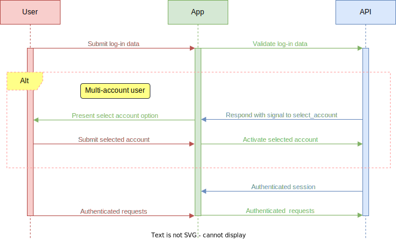

# Logging In
<!--@include: includes/alpha-note.md-->


The login process authenticates an account user for the current session.

## How it works

Submit the username and password to the API for processing. Upon successful authentication, the API will provide an authenticated [session object](sessions).




## Authenticate

Submit the following values from your log in page to the API for user authentication.

### Request

```sh
POST /v1/auth/login
{
  "username": "jdoe",
  "password": "oi3rncu7bjyJXW1L3"
}
```

| Parameter | Type | Description |
| --- | --- | --- |
| `username` | Required string | The users' username. |
| `password` | Required string | The users' password. |

### Response

The current [session object](sessions).

::: warning
If the user is a member of multiple accounts the `session.auth` value will remain `false` until an account is activated.
:::

## Selecting accounts

If a user is a member of multiple accounts, the response will contain a `select_account` value with associated data for your codebase to react upon. The `session.auth` value remains `false` until an account has been activated.

```js
// login response
{
  ...
  "select_account": {
    "accounts": {
      "acc_1234567890": "Foo Account",
      "acc_2345678901": "Bar Account",
      ...
    },
    "last_login": "acc_1234567890"
  },
  ...
}
```

The `select_account.accounts` is an array of accounts to select from. The array keys are the account IDs and the values are the account titles. The `select_account.last_login` value is the account ID the user last selected.

Present an option (e.g., an HTML select) for the user to choose which account to activate.


<!--@include: includes/select-account.md-->


Then submit the selected account ID to the API to activate.

### Request

```sh
`POST /v1/auth/login-account
{
  "account_id": "acc_1234567890"
}
```

| Parameter | Type | Description |
| --- | --- | --- |
| `account_id` | Required string | The account ID selected. |


### Response

The current [session object](sessions).


## Log out

Nullifies the account and user in the current session and sets the `auth` value to `false`. 


### Request

```sh
POST /v1/auth/logout
```


### Response

```js
// session object
{
  "auth": false,
  ...
  }
}
```

The current [session object](sessions). The `auth` value will be `false`.

